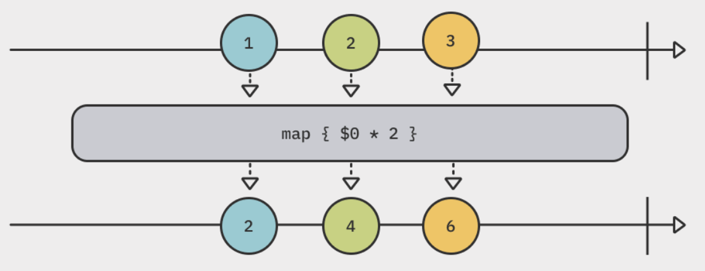

# Transforming Operators

## Summary

- The operator manipulates values from the upstream publisher, and emits mainpulated events downstream.
- An operator is just method that returns a publisher.
- Collecting values
  - [`collect(_:)`](#collect)
- Mapping values
  - [`map(_:)`](#map_)
  - [`tryMap(_:)`](#trymap_)
  - [`flatMap(maxPublisher:_:)`](#flatmapmaxpublishers_)
- Replacing upstream output
  - [`replaceNil(with:)`](#replacenilwith)
  - [`replaceEmpty(with:)`](#replaceemptywith)
- Incrementally transforming output
  - [`scan(_:_:)`](#scan__)
- Be careful when working with buffering operators that do not require specifying a count or limit. **They will use an unbounded amount of memory to store received values** as they won't emit before the upstream finishes.
  - `collect()`
  - `flatMap()`

## Operators

- Operators are methods that **perform an operation on values coming from a publisher**.
- Each Combine operator returns a publisher.
- The publisher receives upstream events, **manipulates them**, and then sends the manipulated events downstream to consumers(subscriber).

## Collecting values

### `collect(_:)`

<p align="center"></p>

```swift
["A", "B", "C", "D", "E"].publisher
    .collect(2) // collects two values at once and emits downstream
    .sink(
        receiveCompletion: { print($0) },
        receiveValue: { print($0) }
    )
    .store(in: &subscriptions)

// Prints
// ["A", "B"]
// ["C", "D"]
// ["E"]
// finished
```

- The `collect(_:)` operator **transforms a stream of individual values from a publisher into a single array**.
- It **buffers** a stream of individual values **until the upstream publisher completes**, and then emits that array downstream.
- It can be specified that how many values collects each time.

## Mapping values

### `map(_:)`

<p align="center"></p>

```swift
[1, 2, 3].publisher
    .map { $0 * 2 }
    .sink { print($0) }
    .store(in: &subscriptions)

// Prints
// 2
// 4
// 6
// finished
```

- The `map(_:)` operator operates on values emitted from a publisher.
- It **re-publishes values as soon as they are published** by the upstream.

```swift
let publisher = PassthroughSubject<Coordinate, Never>();
publisher
    .map(\.x, \.y)
    .sink(receiveValue: { x, y in
        print("Coordinate : (\(x), \(y))")
    })
    .store(in: &subscriptions)
```

- There are three versions that can map into one, two, or three properties of a value **using key paths**.
  - `map<T>(_:)`
  - `map<T0, T1>(_:_:)`
  - `map<T0, T1, T2>(_:_:_:)`

### `tryMap(_:)`

```swift
Just("Dictionary name that does not exist")
    .tryMap { try FileManager.default.contentsOfDictionary(atPath: $0) }
    .sink(
        receiveCompletion: { print($0) },
        receiveValue: { print($0) }
    )
    .store(in: &subscriptions)
```

- The `tryMap(_:)` operator will emit an error downstream if it throws an error.
- It outputs a failure completion event with the appropriate error.

### `flatMap(maxPublishers:_:)`

<p align="center"></p>

```swift
func decode(_ codes: [Int]) -> AnyPublisher<String, Never> {
    Just(
        codes.compactMap { code in
            guard (32...255).contains(code) else { return nil }
            return String(UnicodeScalar(code) ?? " ")
        }
        .joined()
    )
    .eraseToAnyPublisher()
}

[72, 101, 108, 111, 44, 32, 87, 111, 114, 108, 100, 33].publisher
    .collect() // collect values and emits as an array
    .flatMap(decode) // Publisher<[Int], Never> => Publisher<String, Never>
    .sink(receiveValue: { print($0) })
    .store(in: &subscriptions)

// Prints
// Hello, World!
```

- The `flatMap(_:)` operator flattens multiple upstream publishers into a single downstream publisher.
- The publisher returned by `flatMap(_:)` does not be of the same type as the upstream publishers it receives.
- `flatMap(_:)` flattens the output from all received publishers **into a single publisher**.
- It will **buffer as many publishers as you send it** to update the single publisher it emits downstream.
  - This can pose a memory concern.
  - Use `maxPublishers` to limit the number of publishers `flatMap(_:)` can takes.

## Replacing upstream output

### `replaceNil(with:)`

<p align="center"></p>

```swift
["A", nil, "C"].publisher
    .eraseToAnyPublisher()
    .replaceNil(with: "-") // replace `nil` to `-`
    .sink(receiveValue: { print($0) })
    .store(in: &subscriptions)

// Prints
// A
// -
// C
```

- The `replaceNil(with:)` operator will receive optional values and **replace `nil`s with the value you specify**.
- The `??` operator can still result in an `nil` result, while `replaceNil` cannot.

### `replaceEmpty(with:)`

<p align="center"></p>

```swift
let publisher = Empty<Int, Never>()
publisher
    .replaceEmpty(with: 1)
    .sink(
        receiveCompletion: { print($0) },
        receiveValue: { print($0) }
    )
    .store(in: &subscriptions)

// Prints
// 1
// finished
```

- The `replaceEmpty(with:)` operator replaces(or really, insert) a value if a publisher completes **without emitting a value**.
- **It inserts a value and publishes it downstream**.

## Incrementally transforming output

### `scan(_:_:)`

<p align="center"></p>

```swift
let publisher = (0..<22)
    .map { _ in Int.random(in: -10...10) }
    .publisher
publisher
    .scan(50) { latest, current in max(0, latest + current) }
    .sink(receiveValue: { _ in })
    .store(in: &subscriptions)
```

- The `scan(_:_:)` operator will provide the current value emitted by an upstream publisher to a closure, **along with the last value returned by that closure**.
- It begins by storing a starting value. As it receivs each value from the publisher, it adds it to the previously stored value, and then stores and emits the result.
- In the `tryScan(_:_:)` operators closure, if the closure throws an error, it fails with that error and emits completion.
