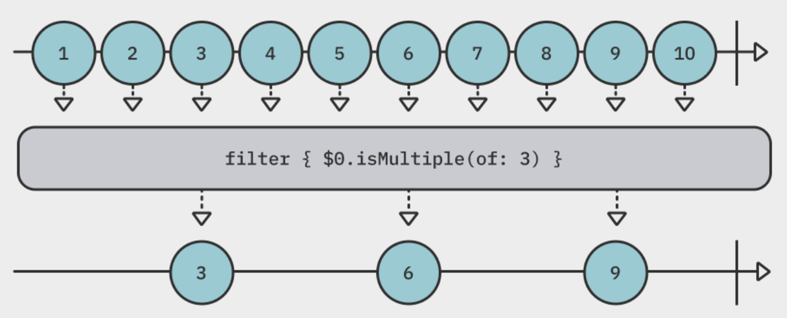
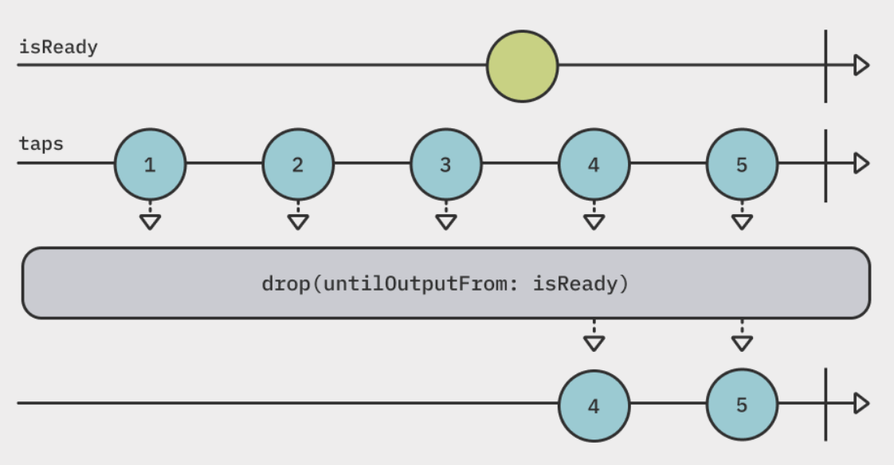

# Filtering Operators

## Summary

- Filtering operators limit the values or events emitted by the publisher, and **only consume some of them**.
- Filtering basics : Filter values that match a provided predicate
  - [`filter(_:)`](#filter_)
  - [`removeDuplicates()`](#removeduplicates)
- Compacting and ignoring : Ignore some values
  - [`compactMap(_:)`](#compactmap_)
  - [`ignoreOutput()`](#ignoreoutput)
- Finding values : Find the first or last values
  - [`first()`, `first(where:)`](#firstwhere)
  - [`last()`, `last(where:)`](#lastwhere)
- Dropping values : How many values are ignored before sending values?
  - [`dropFirst(_:)`](#dropfirst_)
  - [`drop(while:)`](#dropwhile)
  - [`drop(untilOutputFrom:)`](#dropuntiloutputfrom)
- Limitting values : How many values may emit before completing event?
  - [`prefix(_:)`](#prefix_)
  - [`prefix(while:)`](#prefixwhile)
  - [`prefix(untilOutputFrom:)`](#prefixuntiloutputfrom)
- Lazy operators : `first`, `prefix`
- Greedy operators : `last`

## Filtering basics

### `filter(_:)`

<p align="center"></p>

```swift
(1...10).publisher
    .filter { $0.isMultiple(of: 3) }
    .sink { print("\(n) is a multiple of 3") }
    .store(in: &subscriptions)

// Prints
// 3 is a multiple of 3
// 6 is a multiple of 3
// 9 is a multiple of 3
```

- The `filter(_:)` operator passes down values that match the provided predicate.

### `removeDuplicates()`

<p align="center"></p>

```swift
["a", "b", "b", "b", "c", "d", "d", "e", "f"].publisher
    .removeDuplicates()
    .sink(receiveValue: { print($0) })
    .store(in: &subscriptions)

// Prints
// a
// b -> ignore two "b"
// c
// d -> ignore one "d"
// e
// f
```

- The `removeDuplicates()` operator ignore duplicated values.
- It automatically works for any values **conforming to `Equatable`**.
- It has another overload that takes a closure with two values; which you'll return a `Bool` to indicate **whether the values are equal or not**.

## Compacting and ignoring

### `compactMap(_:)`

<p align="center"></p>

```swift
["a", "1.24", "3", "def", "45", "0.23"].publisher
    .compactMap { Float($0) } // ignore "a" and "def" which is returned `nil` by `Float()`.
    .sink(receiveValue: { print($0) })
    .store(in: subscriptions)

// Prints
// 1.24
// 3
// 45
// 0.23
```

- The `compactMap(_:)` operator filters out `nil` values.

### `ignoreOutput()`

<p align="center"></p>

```swift
(1...100).publisher
    .ignoreOutput()
    .sink(
        receiveCompletion: { print($0) },
        receiveValue: { print($0) }
    )
    .store(in: &subscriptions)

// Prints
// finished
```

- The `ignoreOutput()` operator **omits all values and emits only the completion event** to the consumer.
- It can be used when you only want to know that **whether the publisher has finished emitting values**, disregarding the actual values.

## Finding values

### `first(where:)`

<p align="center"></p>

```swift
(1...9).publisher
    .first(where: { $0.isMultiple(of: 2) })
    .sink(
        receiveCompletion: { print($0) },
        receiveValue: { print($0) }
    )
    .store(in: &subscriptions)

// Prints
// 2
// finished
```

- The `first(where:)` operator only takes as many values as it needs **until it finds one matching the predicate** you provided.
  - It's **lazy**.
- As soon as it finds a match, **it cancels the subscription** and completes. -> The publisher doesn't keep emitting.
- If you don't provide `where` closure, it takes **the first value** ever emitted by the publisher. (e.g. `first()`)

### `last(where:)`

<p align="center"></p>

```swift
(1...9).publisher
    .last(where: { $0.isMultiple(of: 2) })
    .sink(
        receiveCompletion: { print($0) },
        receiveValue: { print($0) }
    )
    .store(in: &subscriptions)

// Prints
// 8
// finished
```

- The `last(where:)` operator waits for the publisher to complete emitting values to know **whether a matching value has been found**.
  - It's **greedy**.
- It finds the **last value** matching a provided predicate.
- The publisher must complete for this operator because ther's no way to know if the publisher will emit a matching value.
- **The operator must know the full scope of the publisher** before it can determine the last item matching the predicate.
- If you don't provide `where` closure, it takes **the last value** ever emitted by the publisher. (e.g. `last()`)

## Dropping values

### `dropFirst(_:)`

<p align="center"></p>

```swift
(1...10).publisher
    .dropFirst(7)
    .sink(receiveValue: { print($0) })
    .store(in: subscriptions)

// Prints
// 8
// 9
// 10
```

- The `dropFirst(_:)` operator **ignores the first count values** emitted by the publisher.
- Only after skipping `count` values, the publisher will start passing values.

### `drop(while:)`

<p align="center"></p>

```swift
(1...7).publisher
    .drop(while: { $0 % 5 != 0 }) // ignore values until value is 5
    .sink(receiveValue: { print($0) })
    .store(in: subscriptions)

// Prints
// 5
// 6
// 7
```

- The `drop(while:)` operator ignores any values emitted by the publisher **until the first time that predicate is met**.
- It starts emitting value when the predicate closure returns `true`.
- Difference for `filter(_:)`
  - `filter(_:)`
    - It lets values through if you return `true` in the closure.
    - It never stops evaluating its condition.
  - `drop(while:)`
    - It skips values as long you return `true` from the closure.
    - `while` closure **never be executed again** after the condition is met.

### `drop(untilOutputFrom:)`

<p align="center"></p>

```swift
let isReady = PassthroughSubject<Void, Never>()
let taps = PassthroughSubject<Int, Never>()

taps
    .drop(untilOutputFrom: isReady)
    .sink(receiveValue: { print($0) })
    .store(in: &subscriptions)

(1...5).forEach {
    taps.send($0)

    if $0 == 3 {
        isReady.send()
    }
}

// Prints
// 4
// 5
```

- The `drop(untilOutputFrom:)` operator skips any values emitted by a publisher **until a second publisher starts emitting values**.

## Limitting values

- Receiving values until some condition is met, and then forcing the publisher to complete.

### `prefix(_:)`

<p align="center"></p>

```swift
(1...10).publisher
    .prefix(2)
    .sink(
        receiveCompletion: { print($0) },
        receiveValue: { print($0) }
    )
    .store(in: &subscriptions)

// Prints
// 1
// 2
// finished
```

- The `prefix(_:)` operator take values **only up to the provided amount** and them complete.
- It's **lazy**; **it only takes up as many values as it needs** and them terminates.

### `prefix(while:)`

<p align="center"></p>

```swift
(1...10).publisher
    .prefix(while: { $0 < 3 }) // only takes value when the closure returns `true`
    .sink(
        receiveCompletion: { print($0) },
        receiveValue: { print($0) }
    )
    .store(in: &subscriptions)

// Prints
// 1
// 2
// finished
```

- The `prefix(while:)` operator lets values from the upstream publisher through as long as the result of the closure is `true`.

### `prefix(untilOutputFrom:)`

<p align="center"></p>

```swift
let isReady = PassthroughSubject<Void, Never>()
let taps = PassthroughSubject<Int, Never>()

taps
    .prefix(untilOutputFrom: isReady)
    .sink(receiveValue: { print($0) })
    .store(in: &subscriptions)

(1...5).forEach {
    taps.send($0)

    if $0 == 3 {
        isReady.send()
    }
}

// Prints
// 1
// 2
// 3
// finished
```

- The `prefix(untilOutputFrom:)` operator takes values **until a second publisher emits**.
