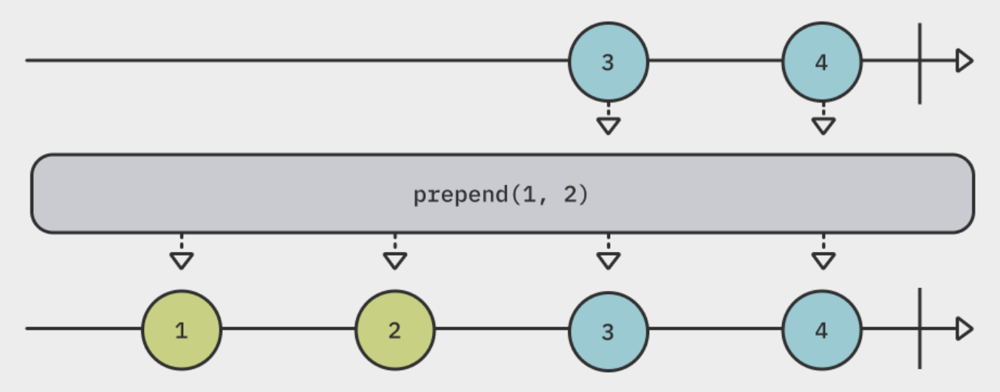
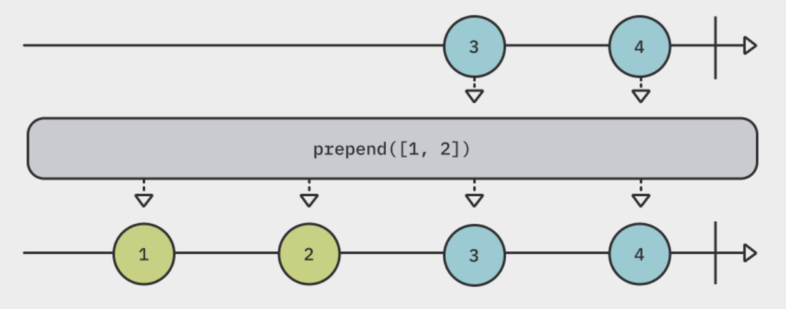
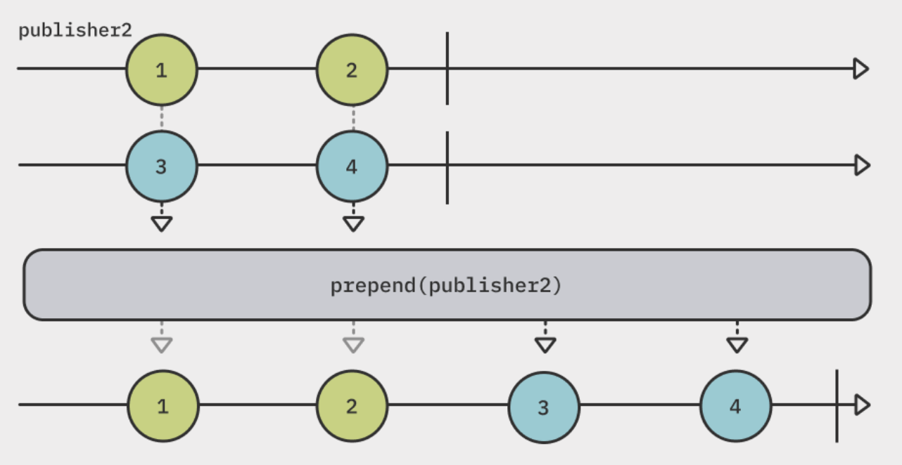
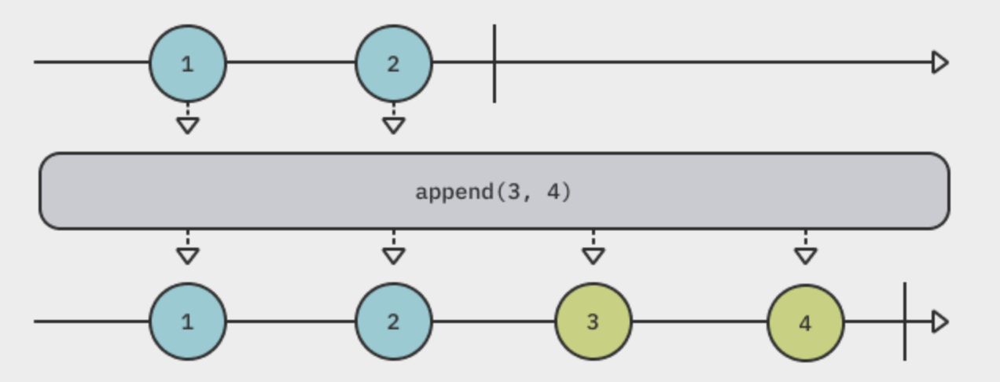
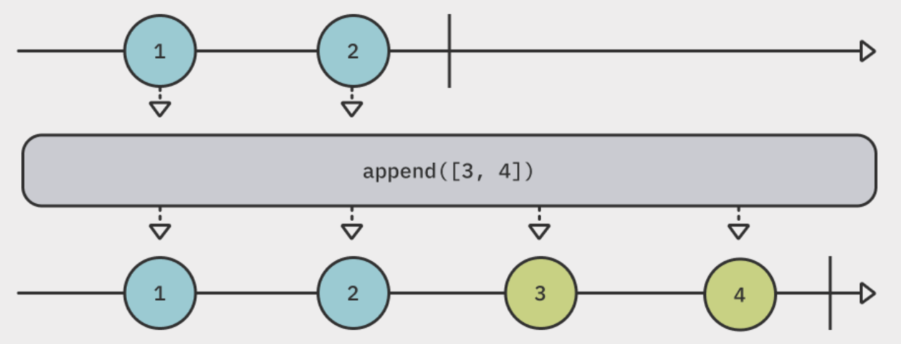
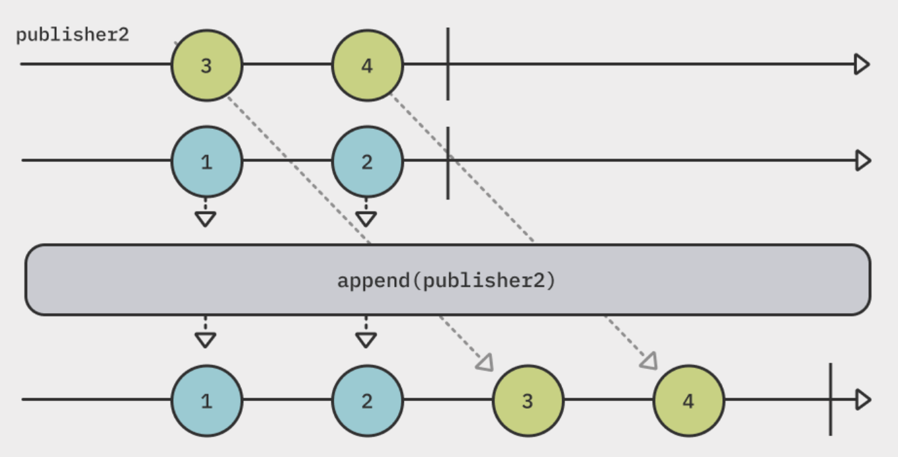
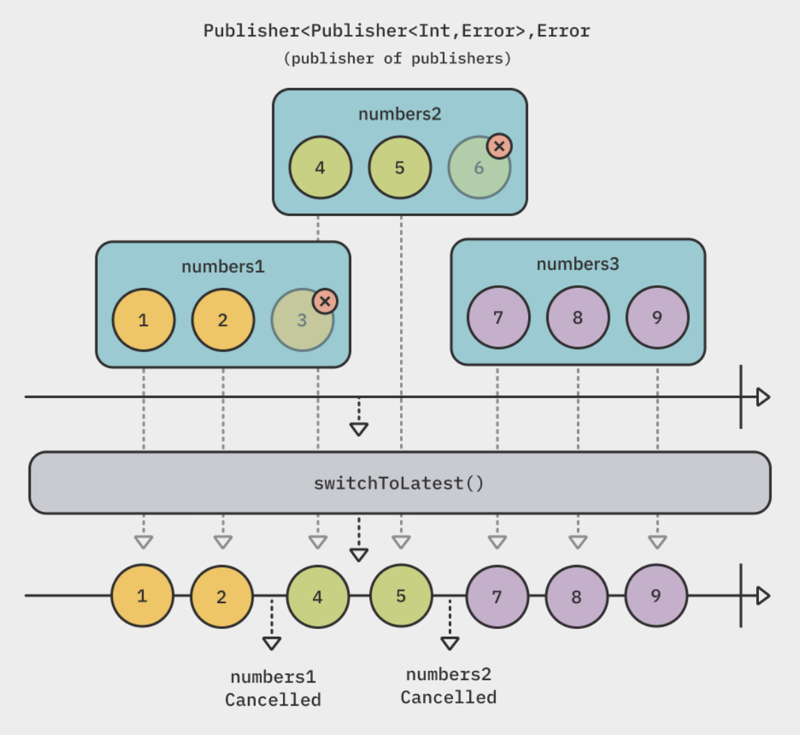
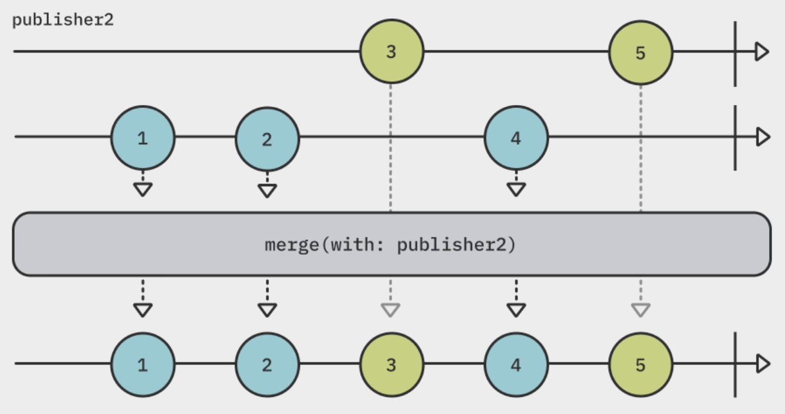
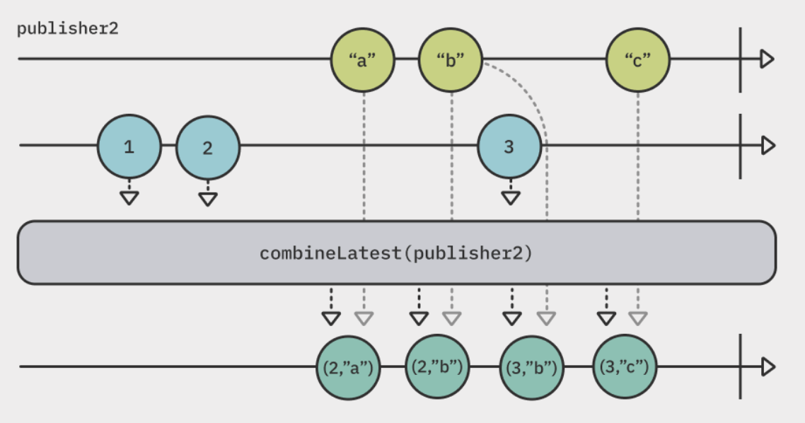
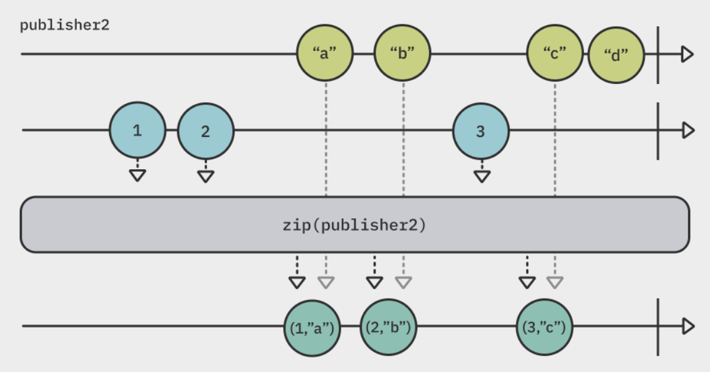

# Combining Operators

## Summary

- Combining operators **combines** events emitted by different publishers and create combinations of data.
- Prepending : prepends values at the beginning of your publisher and emits original values after prepended publishers has completed.
  - [`prepend(Output...)`](#prependoutput)
  - [`prepend(Sequence)`](#prependsequence)
  - [`prepend(Publisher)`](#prependpublisher)
- Appending : appends values after the original publisher has completed.
  - [`append(Output...)`](#appendoutput)
  - [`append(Sequence)`](#appendsequence)
  - [`append(Publisher)`](#appendpublisher)
- Advanced combining
  - [`switchToLatest()`](#switchtolatest)
  - [`merge(with:)`](#mergewith)
  - [`combineLatest(_:)`](#combinelatest_)
  - [`zip(_:)`](#zip_)

## Prepending

### `prepend(Output...)`

<p align="center"></p>

```swift
[3, 4].publisher
    .prepend(1, 2)
    .prepend(-1, 0)
    .sink(receiveValue: { print($0) })
    .store(in: &subscriptions)

// Prints
// -1
// 0
// 1
// 2
// 3
// 4
```

- The `prepend(Output...)` operator **prepends values at the beginning of your publisher**.
- The last prepend affects the upstream first.

### `prepend(Sequence)`

<p align="center"></p>

```swift
[3, 4]
    .prepend([1, 2])
    .prepend(Set([-1, 0]))
    .prepend(stride(from: 1, to: 5, by: 2)) // Stridable conforms to Sequence
    .sink(receiveValue: { print($0) })
    .store(in: &subscriptions)

// Prints
// 1
// 3
// 5
// 0    => the order can be `-1, 0`
// -1
// 1
// 2
// 3
// 4
```

- The `prepend(Sequence)` operator **prepends** values of any `Sequence`-conforming object at the beginning of your publisher.
- With a `Set` object, the order in which the items emit is not guaranteed because values of `Set` are **unordered**.

### `prepend(Publisher)`

<p align="center"></p>

```swift
[3, 4].publisher
    .prepend([1, 2].publisher)
    .sink(receiveValue: { print($0) })
    .store(in: &subscriptions)

// Prints
// 1
// 2
// 3
// 4
```

- The `prepend(Publisher)` operator **prepends** values emitted by a second publisher before the original publisher's values.
- If the second publisher doesn't emit a completion event, the original publisher doesn't emit values.
  - **A prepended publisher must complete**.

## Appending

### `append(Output...)`

<p align="center"></p>

```swift
[1, 2].publisher
    .append(3, 4)
    .sink(receiveValue: { print($0) })
    .store(in: &subscriptions)

// Prints
// 1
// 2
// 3
// 4
```

- The `append(Output...)` operator **appends its items after the original publisher has completed**.
- Each `append` **waits for the upstream to complete** before adding.
  - **The upstream publisher must complete**, or no appending occurs.

### `append(Sequence)`

<p align="center"></p>

```swift
[1, 2].publisher
    .append([3, 4])
    .append(Set([5, 6]))
    .append(stride(from: 7, to: 10, by: 2))
    .sink(receiveValue: { print($0) })
    .store(in: &subscriptions)

// Prints
// 1    => original
// 2
// 3    => added by array
// 4
// 5    => the order can be `6, 5`
// 6
// 7    => added by stride
// 9
```

- The `append(Sequence)` operator **appends** its values after all values from the original publisher have emitted(completed).
- The execution of the appends is sequential as **the previous publisher must complete before the next append performs**.

### `append(Publisher)`

<p align="center"></p>

```swift
[1, 2].publisher
    .append([3. 4].publisher)
    .sink(receiveValue: { print($0) })
    .store(in: &subscriptions)

// Prints
// 1
// 2
// 3
// 4
```

- The `append(Publisher)` operator **appends** any values emitted by appended publisher to the end of the original publisher.

## Advanced combining

### `switchToLatest()`

<p align="center"></p>

```swift
func getImage() -> AnyPublisher<UIImage?, Never> { ~ }

let taps = PassthroughSubject<Void, Never>()
taps.map { _ in getImage() }
    .switchToLatest()
    .sink(receiveValue: { _ in })
    .store(in: &subscriptions)

taps.send() // 1.
DispatchQueue.main.asyncAfter(deadline: .now() + 1) {
    // The previous request is cancelled, and a new request submitted.
    taps.send() // 2.
}
DispatchQueue.main.asyncAfter(deadline: .now() + 2) {
    taps.send() // 3.
}
```

- The `switchToLatest()` operator switch entire publisher subscriptions on the fly while **canceling the pending publisher subscription**.
- **Everytime the original publisher takes a new publisher as an input**, the previous subscription is canceled and it switches to the new one.
- It guarantees **only one publisher will emit values**, and will **automatically cancel** any leftover subscriptions.
- It's useful when **get rid of the pending request and only use a latest network request**.

### `merge(with:)`

<p align="center"></p>

```swift
let publisher1 = PassthroughSubject<Int, Never>()
let publisher2 = PassthroughSubject<Int, Never>()

publisher1
    .merge(with: publisher2)
    .sink(
        receiveCompletion: { print($0) },
        receiveValue: { print($0) }
    )
    .store(in: &subscriptions)

publisher1.send(1)
publisher2.send(2)
publisher1.send(3)
publisher2.send(4)
publisehr1.send(completion: .finished)
publisehr2.send(completion: .finished)

// Prints
// 1
// 2
// 3
// 4
```

- The `merge(with:)` operator **interleaves** emissions from different publishers of the same type.
- **All the publishers must be completed** to completes the entire stream.

### `combineLatest(_:)`

<p align="center"></p>

```swift
let publisher1 = PassthroughSubject<Int, Never>()
let publisher2 = PassthroughSubject<String, Never>()

publisher1.
    .combineLatest(publisher2)
    .sink(
        receiveCompletion: { _ in print("$0") },
        receiveValue: { print("value1 : \($0), value2 : \($1)") }
    )
    .store(in: &subscriptinos)

publisher1.send(1)
publisher2.send(2)
publisher1.send(3)
publisher2.send(4)
publisher1.send(5)

publisehr1.send(completion: .finished)
publisehr2.send(completion: .finished)

// Prints
// value1 : 1, value2 : 2
// value1 : 2, value2 : 3
// value1 : 3, value2 : 4
// value1 : 4, value2 : 5
// finished
```

- The `combineLatest(_:)` operator combines other publishers and **emits a tuple with the latest values of all publishers** whenever any of them emit a value.
- The origin publisher and every publisher passed to `combineLatest(_:)` **must emit at least one value** before `combineLatest` itself will emit anything.
- **It only starts emitting combinations once every publisher emits at least one value**.

### `zip(_:)`

<p align="center"></p>

```swift
let publisher1 = PassthroughSubject<Int, Never>()
let publisher2 = PassthroughSubject<String, Never>()

publisher1.
    .zip(publisher2)
    .sink(
        receiveCompletion: { _ in print("$0") },
        receiveValue: { print("value1 : \($0), value2 : \($1)") }
    )
    .store(in: &subscriptinos)

publisher1.send(1)
publisher2.send(2)
publisher1.send(3)
publisher2.send(4)
publisher1.send(5)

publisehr1.send(completion: .finished)
publisehr2.send(completion: .finished)

// Prints
// value1 : 1, value2 : 2
// value1 : 3, value2 : 4
// finished    => ignores '5'
```

- The `zip(_:)` operator waits for each publishers to emit an item, then **emits a single tuple of items after all publishers have emitted an value at the current index**.
- It emits **a single tuple** emitted every time **both publishers emit a new value**.
- The last emitted value from the zipped publisher is **ignored** since there is no corresponding emission from the original publisher to pari with.
