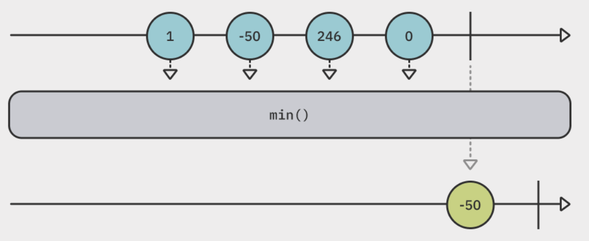
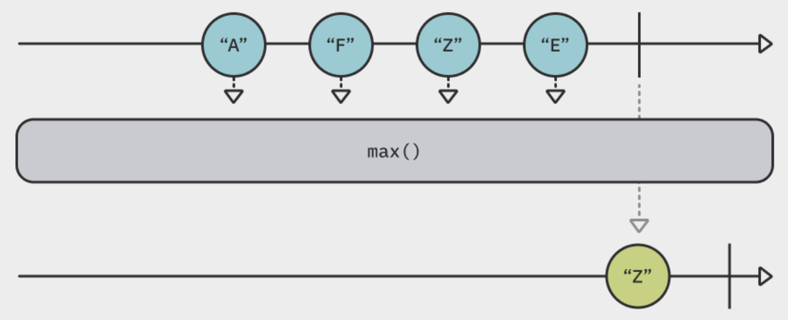
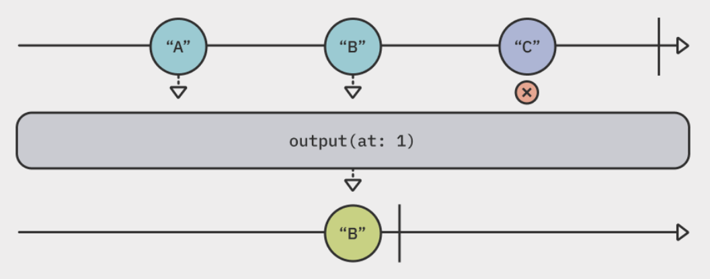
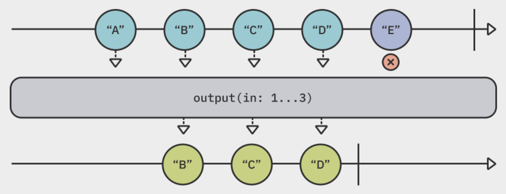
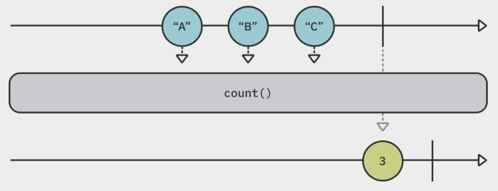
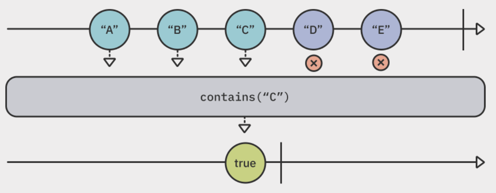
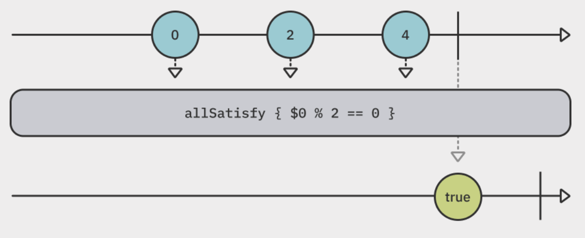
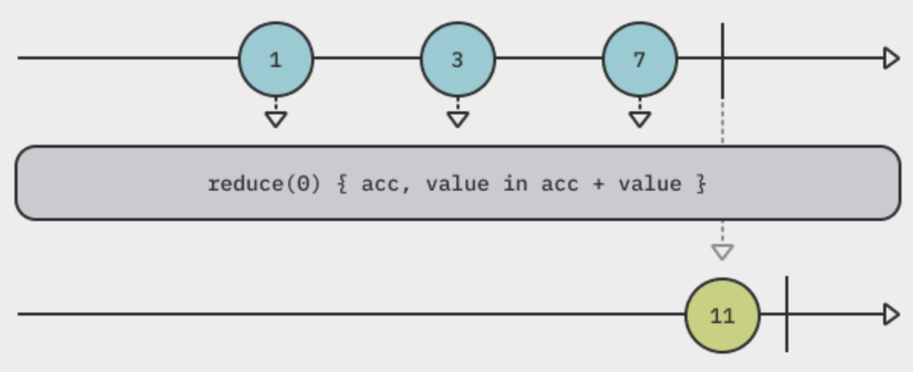

# Sequence Operators

## Summary

- Publishers are just sequences themselves.
- Finding values
  - [`min()`, `min(by:)`](#min-minby)
  - [`max()`, `max(by:)`](#max-maxby)
  - [`first()`](#first)
  - [`last()`](#last)
  - [`output(at:)`](#outputat)
  - [`output(in:)`](#outputin)
- Queriying the publisher
  - [`count()`](#count)
  - [`contains(_:)`, `contains(where:)`](#contains_-containswhere)
  - [`allSatisfy(_:)`](#allsatisfy_)
  - [`reduce(_:_:)`](#reduce__)

## Finding values

### `min()`, `min(by:)`

<p align="center"></p>

```swift
[1, -50, 246, 0].publisher
    .min()
    .sink(receiveValue: { print($0) })
    .store(in: &subscriptions)

// Prints
// -50
```

- The `min()` operator lets you find the minimum value emitted by a publisher.
- **It's greedy**; it must wait for the publisher to send a `.finished` completion event.
- Once the publisher completes, only the minimum value is emitted by the operator.

```swift
["he", "llo", "world"].publisher
    .map { Data($0.utf8) } // Data doesn't conform `Comparable`
    .min(by: { $0.count < $1.count })
    .sink(receiveValue: { print($0) })
    .store(in: &subscriptions)

// Prints
// 2    => bytes of data for "he"
```

- If values from the publisher doesn't conform `Comparable` type, use the `min(by:)` operator.

### `max()`, `max(by:)`

<p align="center"></p>

```swift
[1, -50, 246, 0].publisher
    .max()
    .sink(receiveValue: { print($0) })
    .store(in: &subscriptions)

// Prints
// 246
```

- The `max()` operator finds the maximum value emitted by a publisher.
- **It's greedy**; it must wait for the upstream publisher to finish emitting its values before it determines the maximum value.
- `max()` also has a companion `max(by:)` operator that accetps a predicate to determine the maximum value emitted among non-`Comparable` values.

### `first()`

- The `first()` operator find the first emitted value from the upstream publisher.
- **It's lazy**; it doesn't wait for the upstream publisher to finish. **It cancel the subscription when it receives the first value emitted**.
- Use the `first(where:)` operator to emit the first value that matches a provided predicate.
- Also see : [`first(where:)`](./04-filtering-operators.md#firstwhere)

### `last()`

- The `last()` operator find the last emitted value from the upstream publisher.
- **It's greedy**; it must wait for the publisher to send a `.finished` completion event.
- Use the `last(where:)` operator to emit the last value that matches a provided predicate.
- Also see : [`last(where:)`](./04-filtering-operators.md#lastwhere)

### `output(at:)`

<p align="center"></p>

```swift
[1, 2, 3].publisher
    .output(at: 1)
    .sink(receiveValue: { print($0) })
    .store(in: &subscriptions)
```

- The `output(at:)` operator find a value emitted by the upstream publisher **at the specified index**.
- **It demands one more value** after every emitted value.

### `output(in:)`

<p align="center"></p>

```swift
[1, 2, 3, 4, 5].publisher
    .output(in: 1...3)
    .sink(receiveValue: { print($0) })
    .store(in: &subscriptions)

// Prints
// 2
// 3
// 4
```

- The `output(in:)` operator emits values whose **indices are within a provided range**.
- It emits **individual values** within the range of indices, **not a collection of them**.
- It cancels the subscription as soon as it receives all values within the provided range.

## Querying the publisher

### `count()`

<p align="center"></p>

```swift
[1, 2, 3, 4, 5].publisher
    .count()
    .sink(receiveValue: { print($0) })
    .store(in: &subscriptions)

// Prints
// 5
```

- The `count()` operator will emit a single value - **the number of values were emitted** by the upstream publisher, **once the publisher sends a `.finish` completion event**.

### `contains(_:)`, `contains(where:)`

<p align="center"></p>

```swift
[1, 2, 3, 4, 5].publisher
    .contains(3)
    .sink(receiveValue: { print($0) })
    .store(in: &subscriptions)

// Prints
// true    => values from the upstream publisher has the specified value '3'.
```

- The `contains(_:)` operator will emit `true` and cancel the subscription if **the specified value is emitted** by the upstream publisher.
- **It's lazy**; it only consumes as many upstream values as it needs to perform its work.
- Use `contains(where:)` to find the value that doesn't conform to `Comparable` protocol.

### `allSatisfy(_:)`

<p align="center"></p>

```swift
[0, 2, 4].publisher
    .allSatisfy { $0.isMultiple(of: 2) }
    .sink(receiveValue: { print($0) })
    .store(in: &subscriptions)

// Prints
// true
```

- The `allSatisfy(_:)` operator emits a `Bool` value indicating whether **all values emitted by the upstream publisher match** that predicate.
- If even a single value doesn't pass the predicate condition, **the operator will emit `false` immediately and will cancel the subscription**.

### `reduce(_:_:)`

<p align="center"></p>

```swift
[1, 3, 7].publisher
    .reduce(0, +)
    .sink(receiveValue: { print($0) })
    .store(in: &subscription)

// Prints
// 11
```

- The `reduce(_:_:)` operator **accumulates a new value iteratively** based on the emissions of the upstream publisher.
- It takes a seed value and an accumulator closure which receives the accumulated value starting with the seed value and the current value.
- **Once the operator receives a `.finished` completion event, it emits the final accumulated value**.
- Compare with [`scan(_:_:)`](./03-transforming-operators.md#scan__):
  - The `scan(_:_:)` operator emits the accumulated value **for every emitted value**.
  - The `reduce(_:_:)` operator emits the accumulated value **once the upstream publisher finished**.
